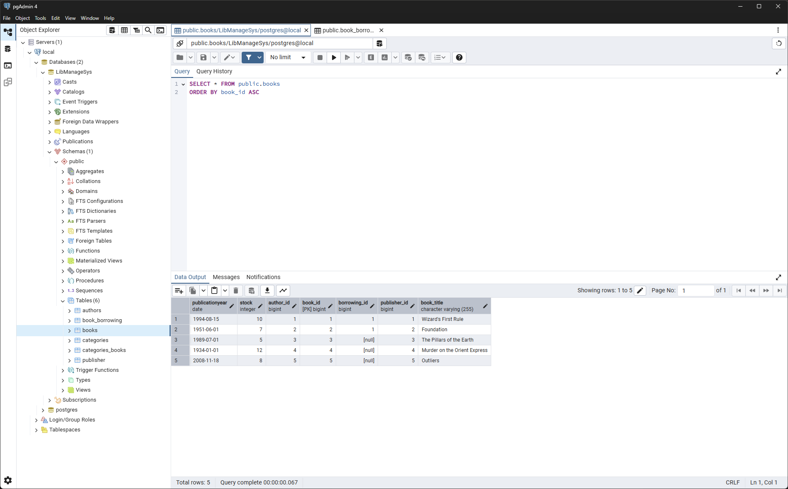

# Book Management System

This is a simple Java application using Spring Boot and Hibernate ORM for managing books, authors, publishers, categories, and book borrowings in a library-like system.

---

## Features

- Manage **Books** with details like title, publication year, stock, categories, author, and publisher.
- Manage **Authors** including name, birth date, country, and their books.
- Manage **Publishers** with name, establishment year, address, and published books.
- Manage **Categories** and their associated books (many-to-many relationship).
- Manage **Book Borrowing** records with borrower info and borrowed books.

---

## Technologies

- Java 17+
- Spring Boot
- Hibernate ORM (JPA)
- MySQL/PostgreSQL (or any relational DB)
- Lombok (for boilerplate code reduction)
- Jakarta Persistence API (JPA)
- Maven/Gradle for build

---

## Code Structure

* `model/` — Entity classes like `Book`, `Author`, `Publisher`, `Category`, and `BookBorrowing`.
* `Main.java` — Main application class demonstrating Hibernate session and CRUD operations.
* `hibernate.cfg.xml` — Hibernate configuration file.

---

# Database Table Screenshots

## Authors

## books_borrowing

## Books

## Categories

## categories_books

## Publisher
